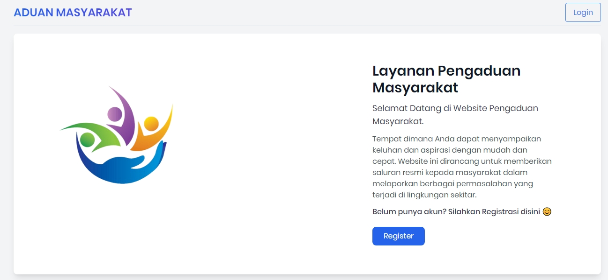

# Pengaduan Masyarakat

Proyek **Pengaduan Masyarakat** adalah sebuah aplikasi berbasis web yang memungkinkan masyarakat untuk menyampaikan keluhan atau pengaduan mengenai layanan publik secara online. Aplikasi ini dikembangkan menggunakan framework Laravel dengan Laravel UI sebagai antarmuka dasarnya.

**Note**
Aplikasi masih tahap pengembangan

## Screenshot

Berikut adalah beberapa tampilan dari aplikasi **Pengaduan Masyarakat**:

### Welcome Page


## Persyaratan Sistem

- PHP >= 8.0
- Composer
- MySQL
- Node.js & NPM
- Laravel 11.x
- Laravel UI

## Instalasi

1. **Clone Repository**
   ```bash
   git clone https://github.com/Fikdev-401/public_complaints.git
   cd public_complaints

2. **Instalasi Dependensi Install dependencies PHP dan JavaScript:**
    ```bash
    composer install
    npm install


3. **Konfigurasi Environment Salin file .env.example menjadi .env dan sesuaikan dengan konfigurasi database Anda:**
    ```bash
    cp .env.example .env

4. **Generate Application Key**
    ```bash
    php artisan key:generate


5. **Migrasi dan Seeder Database Jalankan migrasi untuk membuat tabel yang diperlukan dan seeder untuk data awal:**
    ```bash
    php artisan migrate --seed
    
6. **Instal Laravel UI Aplikasi ini menggunakan Laravel UI untuk autentikasi dan UI bawaan. Jalankan perintah berikut untuk menginstal Laravel UI dan scaffolding Bootstrap:**

    ```bash
    composer require laravel/ui
    php artisan ui bootstrap --auth
    npm install && npm run dev

7. **Menjalankan Server Setelah semua konfigurasi selesai, jalankan server aplikasi:**

    ```bash
    php artisan serve

Akses Aplikasi Buka browser dan akses aplikasi melalui http://localhost:8000.

## Struktur Direktori

Berikut adalah penjelasan singkat mengenai struktur direktori yang ada di proyek ini:

```bash
├── app/                 # Berisi logika aplikasi (controller, model, middleware, dll.)
│   ├── Console/         # Definisi perintah Artisan
│   ├── Exceptions/      # Definisi custom exception
│   ├── Http/            # Berisi controller, middleware, request, dll.
│   ├── Models/          # Model Eloquent
│   └── Providers/       # Penyedia layanan aplikasi
├── bootstrap/           # Konfigurasi bootstrap untuk framework
├── config/              # File konfigurasi aplikasi
├── database/            # Berisi file migrasi, factory, dan seeder
│   ├── factories/       # Factory untuk pembuatan model
│   ├── migrations/      # File migrasi database
│   └── seeders/         # Seeder untuk memasukkan data awal
├── public/              # File yang dapat diakses publik (CSS, JS, gambar)
├── resources/           # Berisi view Blade, file CSS, dan JS
│   ├── css/             # File CSS khusus
│   ├── js/              # File JavaScript khusus
│   ├── lang/            # File terjemahan bahasa
│   └── views/           # File Blade template
├── routes/              # Definisi rute aplikasi
│   ├── api.php          # Definisi rute API
│   └── web.php          # Definisi rute web
├── storage/             # Berisi file log, cache, dan file yang di-upload
│   ├── app/             # File aplikasi yang disimpan
│   ├── framework/       # File cache dan session
│   └── logs/            # File log aplikasi
├── tests/               # Berisi pengujian aplikasi
│   ├── Feature/         # Pengujian fitur aplikasi
│   └── Unit/            # Pengujian unit aplikasi
├── vendor/              # Berisi dependensi Composer
├── .env                 # File environment untuk konfigurasi aplikasi
├── artisan              # File untuk menjalankan perintah Artisan
├── composer.json        # Daftar dependensi PHP proyek
├── package.json         # Daftar dependensi npm proyek
└── webpack.mix.js       # Konfigurasi Laravel Mix untuk pengelolaan asset

# public-complaints
